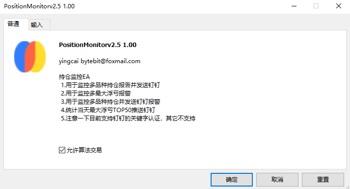
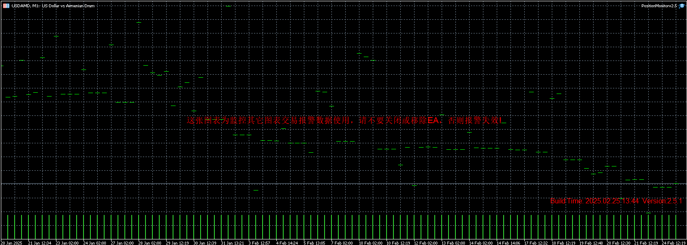
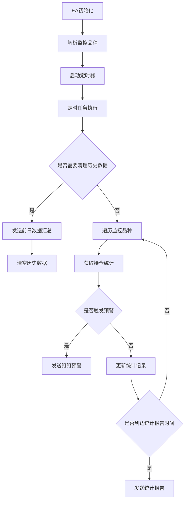

# 持仓监控EA (PositionMonitor)

## 功能概述

这是一个功能强大的MT5持仓监控EA，主要用于实时监控多品种交易持仓情况，并通过钉钉机器人发送通知。

### 核心功能

1. 多品种持仓监控
2. 实时浮亏预警
3. 钉钉消息推送
4. TOP50浮亏统计记录
5. 数据持久化与每日汇总

## 系统流程图

## 参数说明

| 参数名 | 说明 | 默认值 |
|--------|------|--------|
| MaxFloatingLoss | 最大浮亏阈值 | -1000.0 |
| DingDingWebhook | 钉钉机器人Webhook地址 | - |
| DingDingAuthTag | 钉钉认证标签 | EA001 |
| Symbols | 监控品种(用逗号分隔) | XAUUSDm |
| AlertIntervalSeconds | 报警时间间隔(秒) | 60 |
| TimerIntervalSeconds | 定时器间隔(秒) | 10 |
| StatsReportIntervalSeconds | 统计报表发送间隔(秒) | 10800 |
| StatsSaveIntervalMinutes | 统计数据保存间隔(分钟) | 10 |

## 使用说明

1. **安装步骤**
   - 将EA文件复制到MT5的Experts目录
   - 将相关库文件复制到Include目录
   - 重启MT5或刷新EA列表

2. **配置步骤**
   - 配置钉钉机器人并获取Webhook地址
   - 设置钉钉机器人的关键词（与DingDingAuthTag保持一致）
   - 在EA参数中填入Webhook地址和其他参数
   - 选择需要监控的交易品种

3. **运行说明**
   - EA会按照设定的时间间隔监控所有指定品种的持仓
   - 当任何品种的浮亏超过设定阈值时，会发送钉钉预警
   - 每天会自动统计TOP50浮亏记录并定时推送
   - 每个交易日结束时会发送当日数据汇总

## 注意事项

1. **钉钉配置相关**
   - 确保钉钉机器人的关键词与EA设置的AuthTag匹配
   - Webhook地址需要完整且正确
   - 注意钉钉机器人的消息限制（每分钟20条）

2. **性能相关**
   - 监控品种数量会影响EA运行性能
   - 建议根据实际需求调整定时器间隔
   - 统计数据会定期保存到CSV文件，确保有足够磁盘空间

3. **数据管理**
   - 历史数据会在每天GMT 0点自动清理
   - 确保MT5有足够的文件读写权限
   - 定期备份统计数据文件

4. **预警设置**
   - 合理设置MaxFloatingLoss阈值
   - 根据交易频率调整AlertIntervalSeconds
   - 避免过于频繁的预警影响使用

## 更新日志

当前版本：2.5.1

### 主要特性
- 支持多品种监控
- 实时浮亏预警
- TOP50浮亏统计
- 数据持久化
- 每日数据汇总

## 技术支持

- 作者：yingcai
- 邮箱：bytebit@foxmail.com
- 网站：https://www.yingcai.com

## 免责声明

本EA仅用于交易监控，不具备自动交易功能。使用本EA产生的任何损失由使用者自行承担。请在使用前充分测试并理解其功能。
