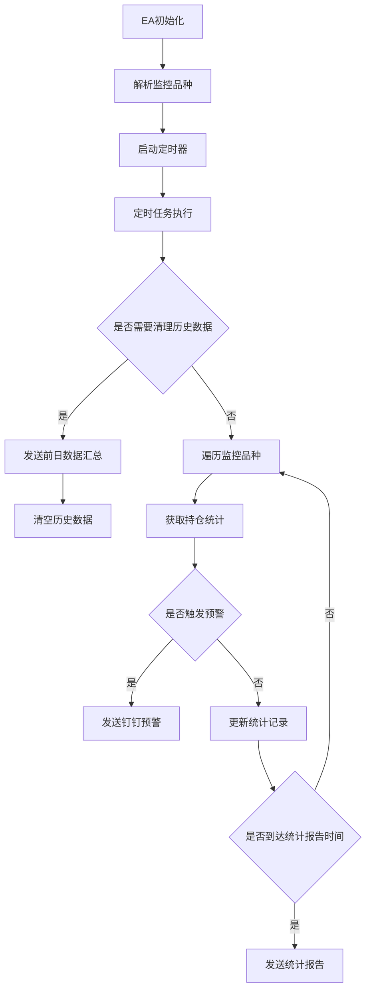

# 持仓监控EA (PositionMonitor)

## 功能概述

这是一个功能强大的MT5持仓监控EA，主要用于实时监控多品种交易持仓情况，并通过钉钉机器人发送通知。


### 核心功能

1. 多品种持仓监控
2. 实时浮亏预警
3. 钉钉消息推送
4. TOP50浮亏统计记录
5. 数据持久化与每日汇总

## 系统流程图




## 参数说明

| 参数名 | 说明 | 默认值 |
|--------|------|--------|
| MaxFloatingLoss | 最大浮亏阈值 | -1000.0 |
| DingDingWebhook | 钉钉机器人Webhook地址 | - |
| DingDingAuthTag | 钉钉认证标签 | EA001 |
| Symbols | 监控品种(用逗号分隔) | XAUUSDm |
| AlertIntervalSeconds | 报警时间间隔(秒) | 60 |
| TimerIntervalSeconds | 定时器间隔(秒) | 10 |
| StatsReportIntervalSeconds | 统计报表发送间隔(秒) | 10800 |
| StatsSaveIntervalMinutes | 统计数据保存间隔(分钟) | 10 |

## 使用说明

1. **安装步骤**
   - 将EA文件复制到MT5的Experts目录
   - 将相关库文件复制到Include目录
   - 重启MT5或刷新EA列表

2. **配置步骤**
   - 配置钉钉机器人并获取Webhook地址
   - 设置钉钉机器人的关键词（与DingDingAuthTag保持一致）
   - 在EA参数中填入Webhook地址和其他参数
   - 选择需要监控的交易品种

3. **运行说明**
   - EA会按照设定的时间间隔监控所有指定品种的持仓
   - 当任何品种的浮亏超过设定阈值时，会发送钉钉预警
   - 每天会自动统计TOP50浮亏记录并定时推送
   - 每个交易日结束时会发送当日数据汇总

## 注意事项

1. **钉钉配置相关**
   - 确保钉钉机器人的关键词与EA设置的AuthTag匹配
   - Webhook地址需要完整且正确
   - 注意钉钉机器人的消息限制（每分钟20条）

2. **性能相关**
   - 监控品种数量会影响EA运行性能
   - 建议根据实际需求调整定时器间隔
   - 统计数据会定期保存到CSV文件，确保有足够磁盘空间

3. **数据管理**
   - 历史数据会在每天GMT 0点自动清理
   - 确保MT5有足够的文件读写权限
   - 定期备份统计数据文件

4. **预警设置**
   - 合理设置MaxFloatingLoss阈值
   - 根据交易频率调整AlertIntervalSeconds
   - 避免过于频繁的预警影响使用

## 更新日志

当前版本：2.5.1

### 主要特性
- 支持多品种监控
- 实时浮亏预警
- TOP50浮亏统计
- 数据持久化
- 每日数据汇总

## 技术支持

- 作者：yingcai
- 邮箱：bytebit@foxmail.com
- 网站：https://www.yingcai.com

## 免责声明

本EA仅用于交易监控，不具备自动交易功能。使用本EA产生的任何损失由使用者自行承担。请在使用前充分测试并理解其功能。

# MT5 Position Monitor CI/CD

使用GitHub Actions v4实现MT5项目的CI/CD流程，包括下载安装MT5、编译项目以及部署到阿里云EC2实例。

## 项目概述

本项目是一个MT5交易策略，使用GitHub Actions实现自动化的CI/CD流程，将编译后的EA部署到阿里云EC2实例上运行。

## 目录结构

```
.
├── .github/
│   └── workflows/
│       ├── mt5-cicd.yml      # GitHub Actions工作流配置
│       └── README.md         # 工作流使用说明
├── deploy-scripts/
│   ├── setup-ec2.sh          # EC2实例设置脚本
│   ├── monitor.sh            # MT5监控脚本
│   └── backup.sh             # MT5数据备份脚本
├── PositionMonitor.mq5       # MT5 EA源代码
├── ChartLabels.mqh           # MT5辅助函数
└── README.md                 # 项目说明文档
```

## CI/CD流程

整个CI/CD流程包括以下步骤：

1. **代码提交**：开发人员将代码提交到GitHub仓库
2. **自动触发**：GitHub Actions自动触发CI/CD流程
3. **下载安装MT5**：在Windows环境中下载并安装MT5
4. **编译项目**：使用MetaEditor编译MT5项目
5. **打包构建产物**：将编译后的文件打包
6. **部署到阿里云EC2**：将构建产物部署到阿里云EC2实例
7. **监控和备份**：在EC2实例上设置监控和备份机制

## 前提条件

在使用此CI/CD流程之前，您需要：

1. 一个GitHub账号和仓库
2. 一个阿里云账号和EC2实例
3. 在GitHub仓库中设置以下密钥（Secrets）：
   - `ALIYUN_SSH_PRIVATE_KEY`: 用于连接阿里云EC2实例的SSH私钥
   - `ALIYUN_HOST`: 阿里云EC2实例的主机地址（IP或域名）
   - `ALIYUN_USERNAME`: 阿里云EC2实例的登录用户名
   - `DEPLOY_PATH`: 阿里云EC2实例上的部署路径

## 使用方法

### 1. 设置GitHub仓库

1. 将本项目代码克隆到您的GitHub仓库
2. 在GitHub仓库中设置必要的密钥（Secrets）

### 2. 配置阿里云EC2实例

1. 创建一个阿里云EC2实例（推荐使用Ubuntu系统）
2. 确保实例具有足够的资源（至少2核4GB内存）
3. 配置安全组，开放必要的端口
4. 将`deploy-scripts`目录中的脚本上传到EC2实例

### 3. 初始化EC2实例

在EC2实例上执行以下命令：

```bash
chmod +x setup-ec2.sh
sudo ./setup-ec2.sh
```

### 4. 设置监控和备份

在EC2实例上设置定时任务：

```bash
# 编辑crontab
crontab -e

# 添加以下内容
# 每5分钟执行一次监控脚本
*/5 * * * * /opt/mt5/monitor.sh
# 每天凌晨2点执行备份脚本
0 2 * * * /opt/mt5/backup.sh
```

## 工作流触发方式

工作流可以通过以下方式触发：

1. 推送代码到`main`分支
2. 创建针对`main`分支的Pull Request
3. 手动触发（通过GitHub Actions界面的"workflow_dispatch"选项）

## 最佳实践

1. **分支管理**：使用`feature`分支进行开发，通过Pull Request合并到`main`分支
2. **代码审查**：在合并Pull Request之前进行代码审查
3. **测试**：在本地测试通过后再推送代码
4. **监控**：定期检查监控日志，确保MT5正常运行
5. **备份**：定期验证备份是否可用
6. **安全**：定期更新EC2实例的系统和软件包
7. **文档**：保持文档的更新，记录任何配置更改

## 故障排除

如果CI/CD流程执行失败，可以通过以下方式排查问题：

1. 查看GitHub Actions执行日志
2. 检查编译日志`compile_log.txt`
3. 在EC2实例上查看部署日志
4. 验证GitHub Secrets是否正确设置

## 贡献指南

欢迎贡献代码和改进建议！请遵循以下步骤：

1. Fork本仓库
2. 创建您的特性分支：`git checkout -b feature/amazing-feature`
3. 提交您的更改：`git commit -m 'Add some amazing feature'`
4. 推送到分支：`git push origin feature/amazing-feature`
5. 创建Pull Request
6. PR

## 许可证

本项目采用MIT许可证 - 详情请参阅[LICENSE](LICENSE)文件  

